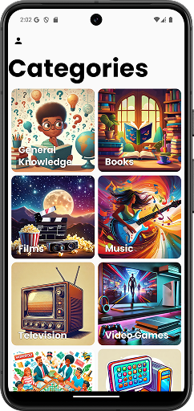
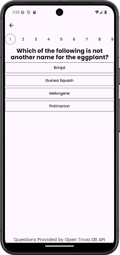
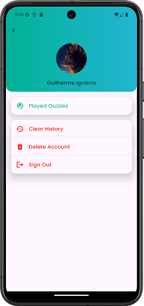
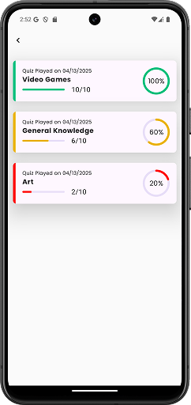

# Brain Tappers🧠

## Table of Contents

- [Introduction](#introduction)
- [Preview](#preview)
- [Technologies Used](#technologies-used)
- [Installation](#installation)
- [Contributing](#contributing)
- [License](#license)

## Introduction
- Brain Tappers is a quiz game for Android, designed for all ages, featuring questions across various categories and difficulty levels.
## Preview

## Technologies Used
- [Kotlin](https://kotlinlang.org/)
- [Jetpack Compose](https://developer.android.com/develop/ui/compose)
- [Koin (Dependency Injection)](https://insert-koin.io)
- [Ktor](https://ktor.io/)
- [Coroutines](https://kotlinlang.org/docs/coroutines-overview.html)
- [Firebase Authentication](https://firebase.google.com/docs/auth)
- [Firestore](https://firebase.google.com/docs/firestore)
- [Crashlytics](https://firebase.google.com/products/crashlytics)
- [Open Trivia Database](https://opentdb.com/)

## Installation
1. Clone this repository `git clone https://github.com/GuilhermeIgnacio/BrainTappers`
2. Open this project in Android Studio
3. Build and run the application on your Android device or emulator

### Or:

- Download it on [Google Play Store]()
- You can find this APK on this repository [here](composeApp/release/composeApp-release.apk)

## Contributing
Contributions are what make the open-source community such an amazing place to learn, inspire, and create. Any contributions you make are **greatly appreciated**.

1. **Fork the Project**
2. **Create your Feature Branch** (`git checkout -b feature/AmazingFeature`)
3. **Commit your Changes** (`git commit -m 'Add some AmazingFeature'`)
4. **Push to the Branch** (`git push origin feature/AmazingFeature`)
5. **Open a Pull Request**

## License
Distributed under the MIT License.

---